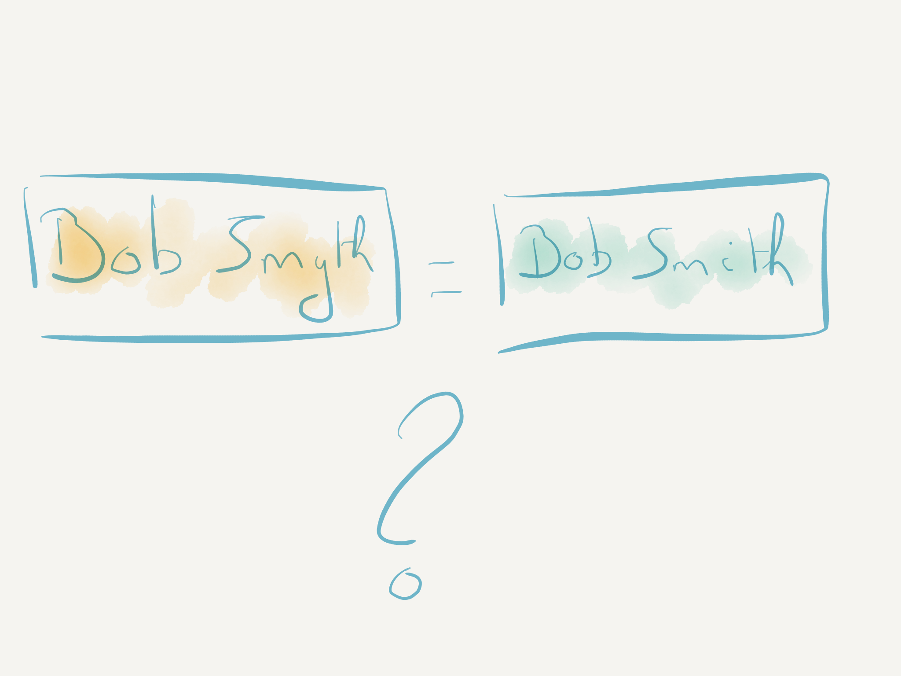

## Overview

1. How did we get here?
2. Data Integration
3. Data Unification

[//]: # (Slide)
## How did we get here?

[//]: # (Slide)
### Organic growth

1 Retailer

A few retailers

A lot retailers and 1 distributor

A lot of retailers and a few distributors

TME to centralise operations accros Europe

[//]: # (Slide)
### Result

All of customer data lives close to the customer

But relevant data is increasingly incoming centrally

How do we link all this data together and feed it back?

[//]: # (Slide)
## Data Integration - Ingestion

Mapping 2 sources

Linking 2 sources

Mapping 3 sources

Linking 3 sources

After some more time and sources

### Y U NO WORK!!1!11

[//]: # (Slide)
## Data Integration - Consumption

Which values do you retain?

What is the origin of the data?

What if multiple consumers of the data have different requirements for the merged entity?

How do you handle data updates in source systems?

How do you handle data updates in consuming systems?

[//]: # (Slide)
## Data Integration

### Slow

* Write a ton of scripts
* Manually profile, clean and map the data

### Costly

* Only scales with people
* Very often outsourced

### Opaque

* No documentation
* No audit trail

### Inefficient
* Low quality results
* Hard to keep up to date

[//]: # (Slide)
## Data Unification

1. Forward flow
2. Feedback flow

[//]: # (Slide)
## Forward flow

[//]: # (Slide)
### Ingest the data

Ingest in schema of source system
(Removes friction)

[//]: # (Slide)
### Map the data

Map fields from source systems into the target schema.

Machine learning assisted

Based on your mappings and the statistical profile of the attributes Tamr will offer mapping recommendations

Effort of mapping the data goes down as more sources are integrated

[//]: # (Slide)
### Link the data

Use ML model to link entities across all the records

Train model by evaluating record pairs

A business user can do this!

Regularly train new pairs to keep the model in sync with changes in the sources

[//]: # (Slide)
### Consume/Merge the data

Multiple views that essentially describe how individual fields are merged

Views are functions over the data -> flexibility

[//]: # (Slide)
## Feedback Flow

Save all updates as immutable events

Create "pseudo" sources by providence

ML model will group events into clusters

[//]: # (Slide)
1. Integrates legacy sources
2. Scales well as a function of sources
3. Obtains knowledge where it resides
4. Supports multiple views/uses of the same base data
5. Avoids the creation of additional sources
6. Allows creation of new processes on top of consolidated data

[//]: # (Slide)
# Questions?
